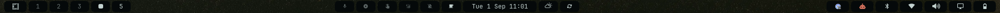
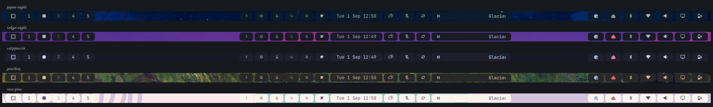

# Islands Bar

A drop-in replacement for the Omarchy status bar where **every widget floats on its own rounded island** instead of sharing one edge-to-edge background.



It is a *styling* layer, not a fork of the bar's behaviour. Widget layout, settings, popups, panels, drag-to-reorder, bar-position gestures and the `omarchy bar` / `omarchy plugin` commands all work exactly as they do on the stock bar, because this plugin is the stock bar engine with its painting changed.

---

## Install

```bash
omarchy plugin add https://github.com/raavail-lasso/Omarchy-Islands-Bar.git
omarchy bar use islands.bar
```

To go back at any time:

```bash
omarchy bar use omarchy.bar
```

Removing the plugin also falls back to the built-in bar automatically.

**Requires** Omarchy 4.x with the Quickshell shell (`omarchy-shell`). Developed and tested against Omarchy 4.0.1 and Quickshell 0.3.1.

---

## What it does

### Islands instead of a bar

The bar window paints nothing. Each widget slot paints its own rounded surface, so the wallpaper shows through the gaps between them, at the screen edges, and between the left, centre and right groups.

Island colour is taken from the active theme's `[bar] background`, so **every theme works with no per-theme setup** — switch themes and the islands follow. Corner radius follows Hyprland's `decoration:rounding`, so the bar matches your window corners.



Nothing above was configured per theme. Light themes work too — `rose-pine` gets pale islands on a pale wallpaper without any special casing.

Works in all four bar positions. Vertical bars get the same treatment on the other axis:


### Per-item islands for grouped widgets

Two widgets normally render several things inside one slot. Here each item gets its own island:

- **Workspaces** — every workspace number is a separate island.

  

- **Indicators** — every indicator is a separate island.

  

### Indicators that hold still

Two changes to indicator behaviour, both scoped to this bar:

- **Always visible.** Indicators do not wait for hover.
- **They don't move when they activate.** The stock widget keeps two separate blocks — inactive and active — and activating an indicator moves it from one to the other, shifting everything after it. This bar renders one block in a stable order and lets each indicator show its state in place, through opacity.

### A refined tray

- **The reveal chevron only appears when something is actually hidden.** The stock tray shows it whenever the tray has any item at all, including when everything is pinned and there is nothing to reveal.
- **The island tracks the drawer animation.** The stock tray permanently reserves the collapsed drawer's full width and masks it. Here the width follows the reveal, so the island grows and shrinks with the slide, and the pinned icons stay perfectly still while it does.
- **Middle-click any tray icon opens the pin/unpin manager.** With the chevron gone once everything is pinned, right-clicking it is no longer an option, so the gesture lives on the icons themselves.

| Everything pinned | One item hidden | Drawer open |
|---|---|---|
|  |  |  |
| No chevron — nothing to reveal | Chevron only; the island is one slot wide | The island has grown to fit the revealed icon |

---

## Limitations

**Three widgets are forked.** `IslandWorkspaces.qml`, `IslandIndicators.qml` and `IslandTray.qml` are modified copies of Omarchy's own widgets, loaded in place of the registry versions. They will not pick up upstream fixes to those widgets. Everything else — audio, network, power, bluetooth, clock, weather, menu, third-party widgets — uses the shared registry and stays current. Tracking Omarchy 4.0.1.

**Middle-click on tray icons is repurposed.** It opens the pin/unpin manager instead of calling the tray item's `secondaryActivate()`. Few applications implement that method, but if one you use does, you will lose it.

**Third-party widgets that paint their own background** will render as a box inside a box. Widgets built against the stock bar sometimes draw their own fill rather than letting the bar own it.

**Widgets that reserve width they do not paint** get an oversized island, since the island is sized from the widget's `implicitWidth`. This is what the tray did before it was adapted.

Both of the last two are fixable the same way the bundled widgets were: copy the widget into `widgets/`, adjust it, and add an entry to `localWidgetOverrides` in `Bar.qml`.

---

## How it is put together

```
Bar.qml                        bar engine (modified Omarchy source)
BarModel.js                    layout helpers
manifest.json                  kind: "bar", entry point Bar.qml
widgets/IslandWorkspaces.qml   one island per workspace number
widgets/IslandIndicators.qml   one island per indicator, single-block state
widgets/IslandTray.qml         conditional chevron, animated width, middle-click manager
widgets/TrayModel.js           tray helpers
indicators/*.qml               the six indicator components
```

Three mechanisms in `Bar.qml` do the work:

**`localWidgetOverrides`** maps a widget id to a QML file in this repo. `ModuleSlot` checks it before the shared registry and loads the local file through the url `Loader`. The layout entry still says `omarchy.workspaces` — only this bar swaps what it loads, so nothing in `shell.json` changes and other bars are unaffected.

**`selfIslandWidgets`** lists which of those paint an island per item, so the slot does not also paint one behind them. The tray is overridden but not listed, because it stays a single group island.

**`widgetSettingOverrides`** merges forced widget settings over whatever `shell.json` supplies — it is how the indicators stay revealed here without changing the shared config. It is applied in both places the bar hands settings to a widget: `ModuleSlot.injectProps()` and the in-place `applySettingsDelta()` fast path.

To adapt another widget, copy it into `widgets/`, add the island, and add one line to `localWidgetOverrides`.

---

## Credits and licence

Derived from the [Omarchy](https://github.com/basecamp/omarchy) shell by Basecamp and the Omarchy contributors, used under the MIT Licence. `Bar.qml`, `BarModel.js`, `widgets/TrayModel.js`, the `indicators/` components and the `widgets/Island*.qml` files are modified copies of Omarchy source.

MIT — see [LICENSE](LICENSE).
